[](https://git.io/typing-svg)


## 📚 项目概述

审学汇是一个专为高校学生设计的资源共享平台，旨在解决学生在学习过程中获取专业资料和教学资源的痛点。平台采用微服务架构，前后端分离设计，融合了现代化的云原生技术栈，提供了丰富的资源管理和搜索功能。

通过审学汇，用户可以：

- 🔍 **快速搜索**：使用基于Elasticsearch的高级搜索引擎快速找到所需资料
- 📤 **资源分享**：上传优质学习资料，与校内同学共享知识
- 📩 **资源需求**：发布特定学习资源的需求
- ⭐ **收藏管理**：收藏常用资料，方便日后查找使用
- 👤 **个人中心**：管理个人资料、上传记录、下载历史和收藏夹
- 🌟 **资源评分**：对资源进行点赞、评价，筛选优质内容

## 🏗️ 系统架构

审学汇采用基于微服务的云原生架构，主要包含以下几个部分：

### 产品架构图

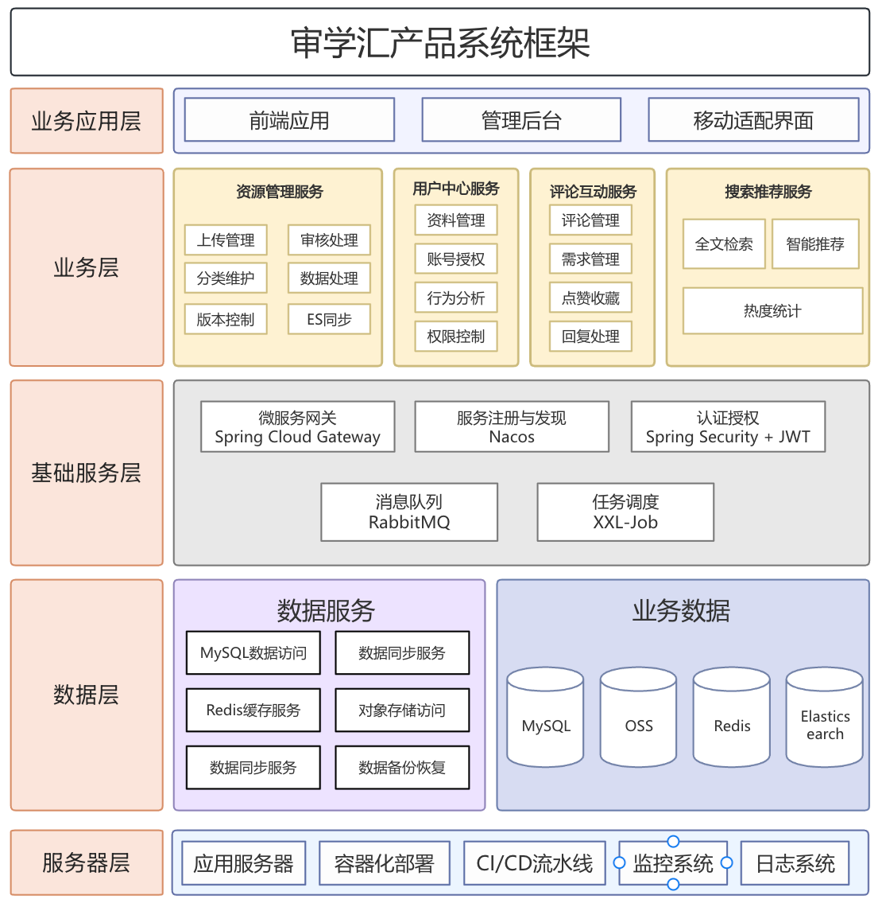

- **前端应用层**：基于Vue3、Element Plus和Vite构建的SPA应用
- **API网关**：使用Spring Cloud Gateway实现路由、负载均衡、认证等功能
- **业务服务集群**：基于Spring Boot的微服务，包含用户服务、资源服务、评论服务等
- **服务治理**：使用Nacos实现服务注册发现和配置管理
- **消息队列**：通过RabbitMQ实现服务间的异步通信，如资源同步到Elasticsearch
- **持久化层**：使用MySQL存储结构化数据，对于全文检索需求使用Elasticsearch

### 包结构图

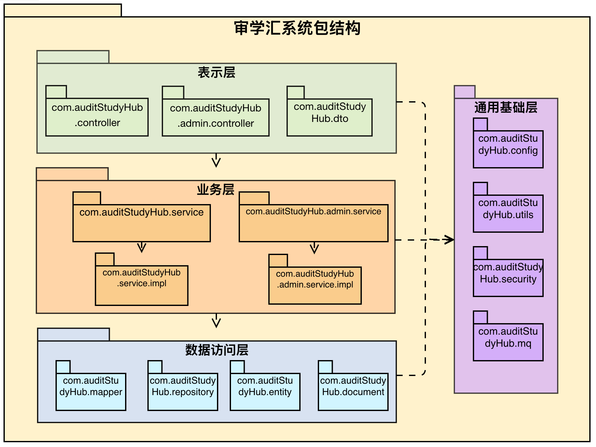

## 🔧 技术栈详解

### 后端技术栈

| 技术                 | 版本       | 说明               |
| -------------------- | ---------- | ------------------ |
| Java                 | 17         | 运行环境           |
| Spring Boot          | 3.1.5      | 应用开发框架       |
| Spring Cloud         | 2022.0.4   | 微服务解决方案     |
| Spring Cloud Alibaba | 2022.0.0.0 | 阿里巴巴微服务生态 |
| MyBatis-Plus         | 3.5.3.2    | ORM框架            |
| Spring Security      | 5.7.x      | 安全框架           |
| JWT                  | 0.11.x     | 认证授权           |
| MySQL                | 8.0.33     | 关系型数据库       |
| Redis                | 6.2        | 缓存及分布式锁     |
| Elasticsearch        | 8.10.4     | 全文搜索引擎       |
| RabbitMQ             | 3.9        | 消息队列           |
| Nacos                | 2.2.0      | 服务发现和配置管理 |
| Docker               | 20.10+     | 容器化部署         |
| Prometheus + Grafana | -          | 监控可视化         |

### 前端技术栈

| 技术         | 版本      | 说明           |
| ------------ | --------- | -------------- |
| Node.js      | >=20.10.0 | 运行环境       |
| Vue          | 3.5.13    | 前端框架       |
| Vite         | 6.3.1     | 构建工具       |
| Element Plus | 2.9.9     | UI组件库       |
| Vue Router   | 4.5.1     | 路由管理       |
| Pinia        | 3.0.2     | 状态管理       |
| Axios        | 1.9.0     | HTTP客户端     |
| TypeScript   | 5.7.2     | 类型系统       |
| ECharts      | 5.x       | 数据可视化     |
| Sass         | 1.88.0    | CSS预处理器    |
| ESLint       | 8.x       | 代码质量检查   |
| Nginx        | 1.20+     | 静态资源服务器 |

## 🚀 核心功能

### 1. 资源管理系统

- **资源分类体系**：多级分类管理，支持按学院、专业、课程等维度组织
- **资源上传**：支持多种格式文件上传，自动提取文件元信息
- **资源审核**：管理员审核机制，确保内容质量和合规性
- **版本控制**：支持资源更新和历史版本查看

### 2. 高级搜索引擎

- **全文检索**：基于Elasticsearch的全文搜索，支持中文分词
- **高级过滤**：多维度过滤，包括分类、学院、文件大小、上传时间等
- **相关性排序**：基于用户行为和文档特征的智能排序算法
- **搜索建议**：根据热门搜索和用户历史提供搜索建议
- **搜索结果高亮**：关键词高亮显示

### 3. 用户系统

- **账户管理**：注册、登录、密码重置、个人资料管理
- **权限控制**：基于RBAC的权限模型
- **用户行为分析**：记录用户搜索、下载、收藏等行为

### 4. 互动功能

- **评论系统**：对资源发表评论和讨论
- **点赞/收藏**：支持资源点赞和个人收藏夹
- **资源请求**：发布特定资源的需求请求
- **通知系统**：站内消息和邮件通知

### 5. 管理后台

- **用户管理**：管理用户账号、权限和行为
- **资源管理**：审核、编辑、删除资源
- **数据统计**：平台使用情况、热门资源分析
- **系统监控**：服务健康状态和性能监控，并支持使用日志监控用户行为
- **系统管理**：提供接口、菜单和数据字典的维护

## 📱 系统功能与界面展示

### 数据模型与设计

#### 数据库ER图
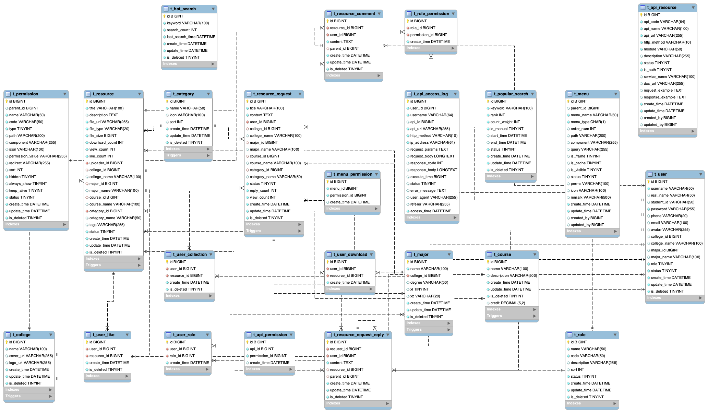

#### 用例图
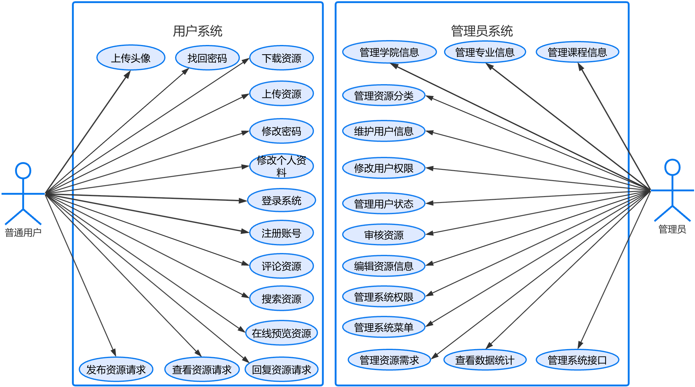

### 用户界面与功能

| | |
|---|---|
| **首页** | **无限评论树** |
| 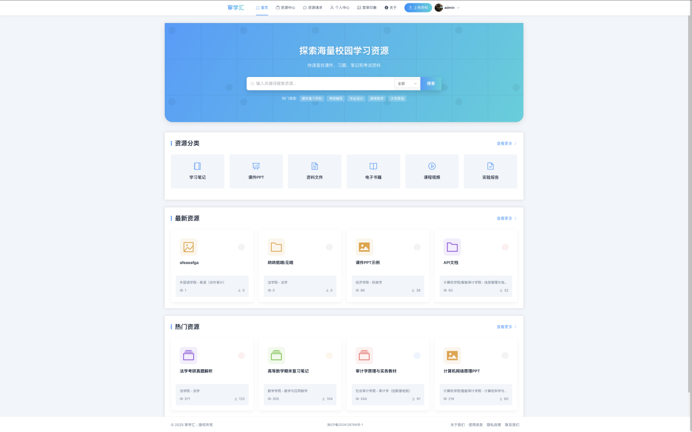 | 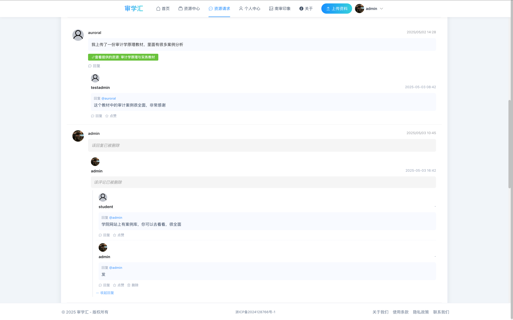 |
| **资源列表** | **资源详情** |
|  |  |
| **资源需求** | **上传资源** |
| 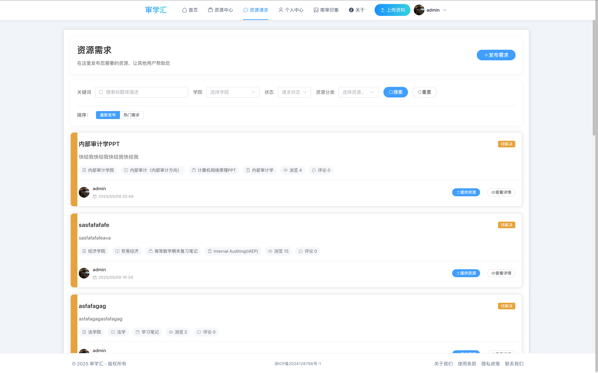 | 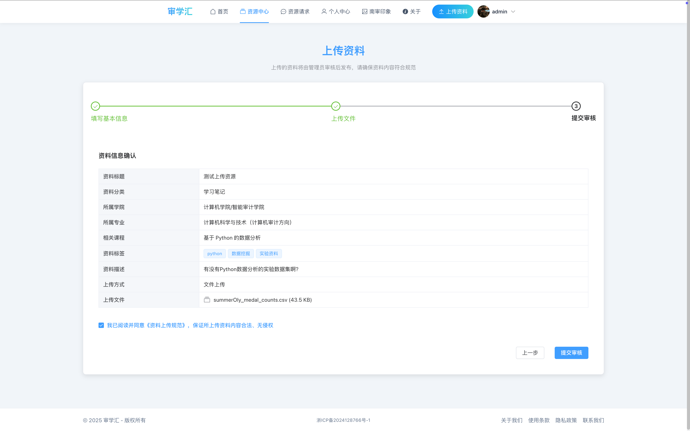 |
| **个人信息维护** | **后台登录** |
| 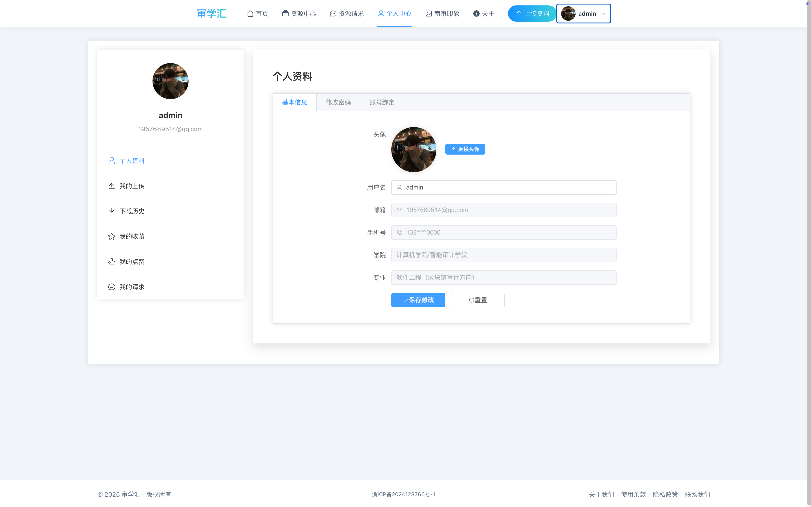 | 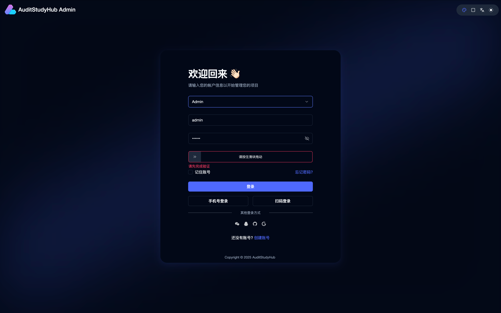 |
| **后台注册** | **后台资源管理** |
| 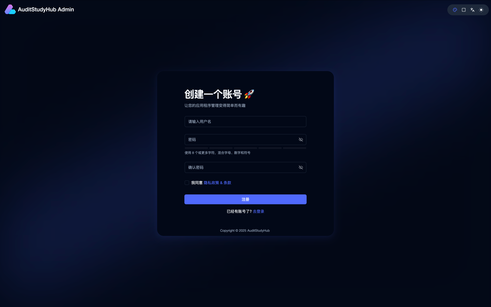 | 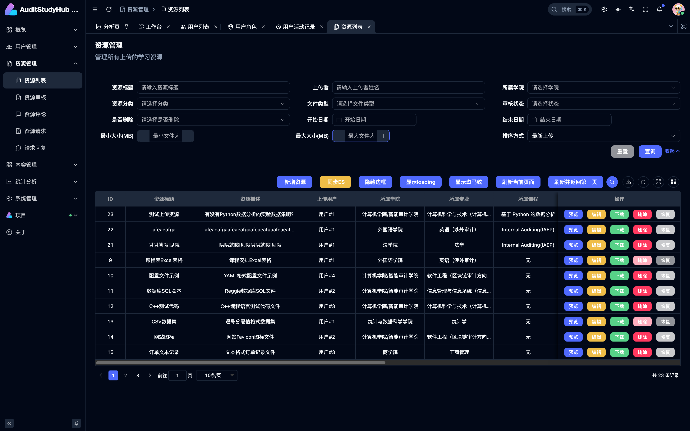 |
| **后台评论管理** | **后台用户行为分析** |
| 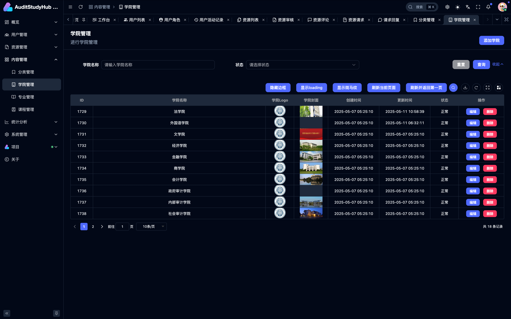 | 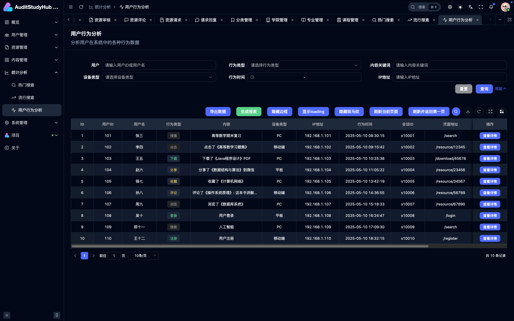 |
| **接口管理** | **日志管理** |
| 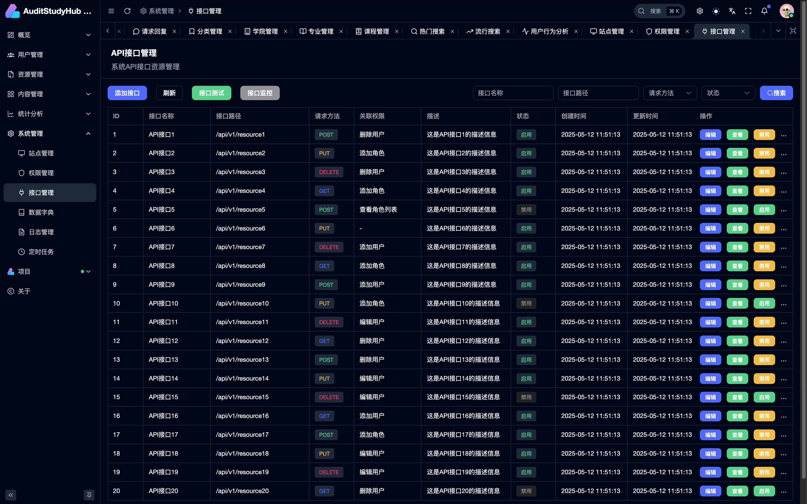 | 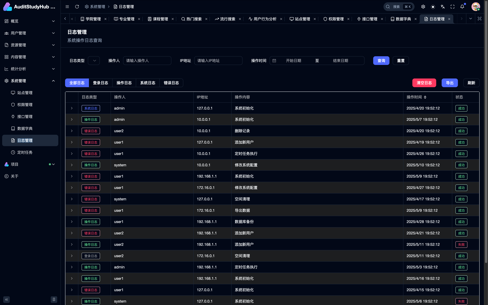 |

## 📁 项目结构

```
审学汇/
├── audit-study-hub-cloud/       # 后端微服务项目
│   ├── audit-study-hub-backend/     # 主要业务服务
│   │   ├── src/main/java/com/auditStudyHub/
│   │   │   ├── controller/           # 控制层
│   │   │   ├── service/              # 服务层
│   │   │   ├── mapper/               # 数据库映射层
│   │   │   ├── entity/               # 实体类
│   │   │   ├── dto/                  # 数据传输对象
│   │   │   ├── document/             # ES文档模型
│   │   │   ├── config/               # 配置类
│   │   │   ├── exception/            # 异常处理
│   │   │   └── util/                 # 工具类
│   │   └── src/main/resources/       # 配置资源
│   ├── audit-study-hub-config/       # 配置服务
│   ├── audit-study-hub-registry/     # 服务注册中心
│   ├── elasticsearch/                # ES配置和数据
│   ├── mysql/                        # MySQL配置和脚本
│   ├── redis/                        # Redis配置
│   ├── rabbitmq/                     # RabbitMQ配置
│   ├── nacos/                        # Nacos配置
│   ├── prometheus/                   # 监控配置
│   ├── grafana/                      # 监控可视化配置
│   ├── k8s/                          # Kubernetes配置
│   └── docker-compose.yml            # Docker编排文件
│
├── audit-study-hub-frontend/     # 前端Vue项目
│   ├── public/                      # 静态资源
│   └── src/
│       ├── api/                     # API接口
│       ├── assets/                  # 静态资源
│       ├── components/              # 公共组件
│       ├── router/                  # 路由配置
│       ├── stores/                  # 状态管理
│       ├── types/                   # TypeScript类型定义
│       ├── utils/                   # 工具函数
│       └── views/                   # 页面组件
│
└── audit-study-hub-admin/        # 管理后台项目
    ├── apps/
    │   └── web-ele/                 # 基于Element Plus的管理界面
    └── packages/                    # 公共包
```


## 📦 快速部署指南

系统提供了一套完整的部署脚本，可以快速部署整个微服务架构和相关组件。

### 环境要求

- JDK 17
- Maven 3.6+
- Node.js 21
- Docker & Docker Compose
- MySQL 8.0+
- Redis 6.0+

### 1. 使用部署脚本

项目提供了一键部署脚本，位于 `audit-deployment` 目录下：

```bash
# 进入部署目录
cd audit-deployment

# 授予执行权限
chmod +x start.sh

# 执行部署脚本
bash start.sh
```

该脚本会自动完成以下工作：
- 清理现有Docker容器
- 创建必要的目录结构
- 创建Docker网络
- 启动所有基础服务（MySQL, Redis, RabbitMQ, Nacos, Elasticsearch, Kibana, Prometheus, Grafana）
- 编译Spring Boot微服务
- 生成详细的部署报告和访问信息

### 2. 配置敏感信息

在导入Nacos配置前，请修改以下敏感信息：

#### 阿里云OSS配置

编辑 `audit-deployment/DEFAULT_GROUP/.env.dev` 文件，填入您的阿里云OSS信息：

```bash
# 阿里云OSS配置
OSS_ENDPOINT=https://oss-cn-region.aliyuncs.com    # 替换为您的OSS端点
OSS_ACCESS_KEY_ID=your_access_key_id              # 替换为您的AccessKey ID
OSS_ACCESS_KEY_SECRET=your_access_key_secret      # 替换为您的AccessKey Secret
OSS_BUCKET_NAME=your_bucket_name                  # 替换为您的存储桶名称
OSS_URL_PREFIX=https://your_bucket_name.oss-cn-region.aliyuncs.com  # 替换为您的存储桶访问URL
```

#### 邮箱配置

编辑 `audit-deployment/DEFAULT_GROUP/.env.dev` 文件，填入您的邮箱信息：

```bash
# 邮箱配置
MAIL_HOST=smtp.163.com                         # 邮件服务器地址
MAIL_USERNAME=your_email@163.com               # 替换为您的邮箱地址
MAIL_PASSWORD=your_email_auth_code             # 替换为您的邮箱授权码
```

> **重要提示**：请务必在导入Nacos配置前完成敏感信息的修改，否则可能导致功能不可用或安全风险。

### 3. 导入Nacos配置

在脚本执行过程中，需要手动导入Nacos配置：

1. 创建名为 **DEFAULT_GROUP** 的文件夹
2. 复制三个配置文件到该文件夹中:
   - application-backend.yml
   - application-backend-dev.yml
   - .env.dev
3. 将整个文件夹压缩为 **DEFAULT_GROUP.zip**
4. 登录Nacos控制台: http://localhost:8848/nacos/ (用户名/密码: nacos/nacos)
5. 在控制台中导入压缩包

### 4. 启动后端微服务

```bash
# 进入jars目录
cd audit-deployment/jars

# 按顺序启动各服务
# 1. 先启动注册中心
java -jar audit-study-hub-registry-0.0.1-SNAPSHOT.jar

# 2. 再启动配置中心
java -jar audit-study-hub-config-0.0.1-SNAPSHOT.jar

# 3. 最后启动后端服务
java -jar audit-study-hub-backend-0.0.1-SNAPSHOT.jar
```

### 5. 启动前端应用

#### 管理端 (Admin)

```bash
# 进入管理端目录
cd audit-study-hub-admin

unset NODE_OPTIONS

nvm install 21
nvm use 21

# 安装依赖
pnpm install

# 启动开发服务器
pnpm dev:ele
```

访问地址: http://localhost:5777

#### 用户端 (Frontend)

```bash
# 进入用户端目录
cd audit-study-hub-frontend

# 安装依赖
npm install

# 启动开发服务器
npm run dev
```

访问地址: http://localhost:3000

### 6. 服务访问地址

| 服务名称 | 访问地址 | 用户名/密码 | 说明 |
|---------|---------|------------|------|
| 管理端前端 | http://localhost:5777 | - | 系统管理界面 |
| 用户端前端 | http://localhost:3000 | - | 用户学习界面 |
| Nacos | http://localhost:8848/nacos/ | nacos/nacos | 服务注册与配置中心 |
| Elasticsearch | http://localhost:9201 | - | 全文搜索引擎 |
| Kibana | http://localhost:5601 | - | ES数据可视化 |
| Prometheus | http://localhost:9090 | - | 监控数据 |
| Grafana | http://localhost:13000 | admin/admin | 监控仪表盘 |
| RabbitMQ | http://localhost:15672 | guest/guest | 消息队列管理界面 |
| MySQL | localhost:13306 | root/root | 数据库服务 |
| Redis | localhost:16379 | - | 缓存服务 |

更详细的部署说明请参考 `audit-deployment/使用说明.md` 文件。

## 📋 使用指南

### 访问地址

- **前端应用**：http://localhost:80
- **API文档**：http://localhost:5777/doc.html
- **后端API网关**：http://localhost:5777
- **管理后台**：http://localhost:5173

### 监控与管理工具

- **Nacos控制台**：http://localhost:8848/nacos (用户名/密码: nacos/nacos)
- **RabbitMQ管理界面**：http://localhost:15672 (用户名/密码: guest/guest)
- **Elasticsearch**：http://localhost:9201
- **Kibana**：http://localhost:5601
- **Prometheus**：http://localhost:9090
- **Grafana**：http://localhost:13000 (用户名/密码: admin/admin)

## 💡 项目特色

1. **微服务架构**：基于Spring Cloud生态实现高可用、可扩展的微服务架构
2. **高性能搜索**：使用Elasticsearch实现复杂的全文搜索和多维度过滤
3. **云原生支持**：全面容器化，支持Docker和Kubernetes部署
4. **高级缓存策略**：多级缓存设计，提升系统响应速度
5. **实时数据同步**：基于RabbitMQ的消息驱动架构，确保数据一致性
6. **完善的监控**：集成Prometheus和Grafana，实现全方位系统监控
7. **扩展性设计**：模块化和插件化设计，方便功能扩展
8. **响应式前端**：基于Vue3的现代化响应式前端，支持多端适配

## 🛠️ 开发指南

### 后端开发规范

1. **代码风格**：遵循阿里巴巴Java开发手册规范
2. **包命名**：按功能模块划分，com.auditStudyHub.[模块].[层次]
3. **接口设计**：遵循RESTful API设计规范
4. **错误处理**：统一异常处理，规范化返回结果
5. **文档注释**：使用Swagger注解生成API文档

### 前端开发规范

1. **组件设计**：遵循单一职责原则
2. **状态管理**：合理使用Pinia管理全局状态
3. **TypeScript**：使用类型定义提高代码质量
4. **样式管理**：使用Sass进行模块化样式管理
5. **响应式设计**：适配不同屏幕尺寸

### 开发流程

1. 拉取最新代码并创建功能分支
2. 本地开发并测试
3. 提交PR请求并通过代码审查
4. 合并到主分支并自动部署

## 👨‍💻 团队与贡献

### 核心团队

- **Auroral** - 项目负责人 & 全栈开发

### 贡献指南

1. Fork 项目
2. 创建您的特性分支 (`git checkout -b feature/amazing-feature`)
3. 提交您的更改 (`git commit -m 'Add some amazing feature'`)
4. 推送到分支 (`git push origin feature/amazing-feature`)
5. 开启一个 Pull Request

## 📄 许可证

[MIT](LICENSE) © Audit Study Hub Team

---

## 📞 联系我们

- **邮箱**： 15968588744@163.com
- **QQ**： 1957689514
- **问题反馈**：[GitHub Issues](https://github.com/Auroral0810/audit-study-hub/issues)
- **微信公众号**：审学汇

---

感谢您对审学汇项目的关注！我们期待您的参与和贡献，一起打造更好的校园资源共享平台。
