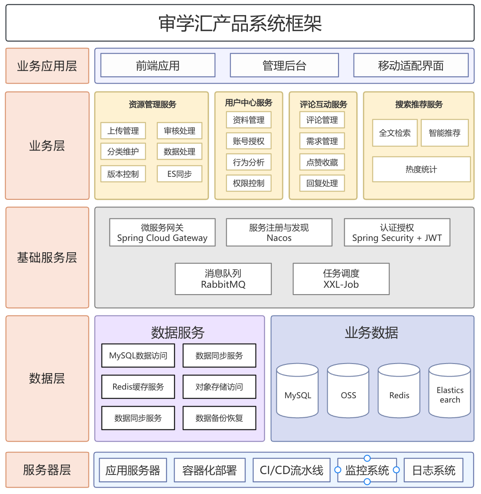
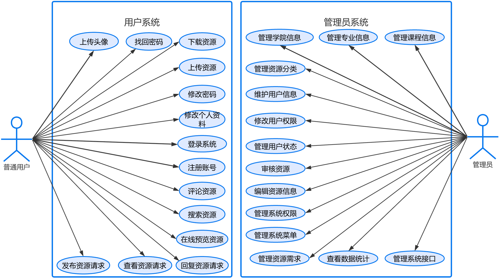
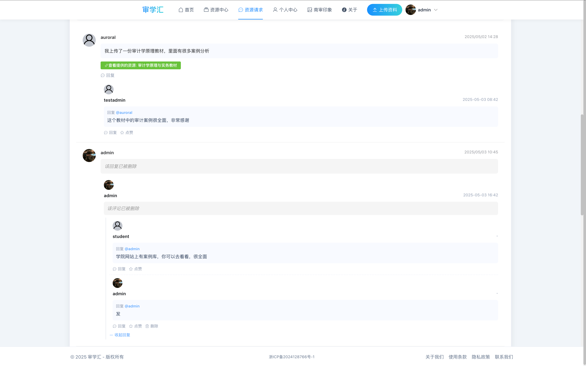
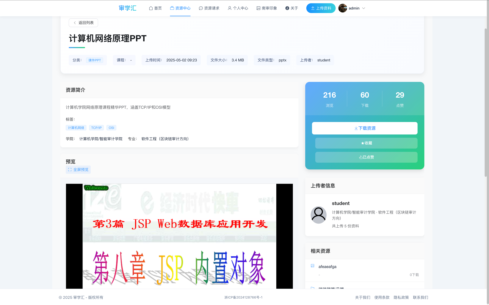
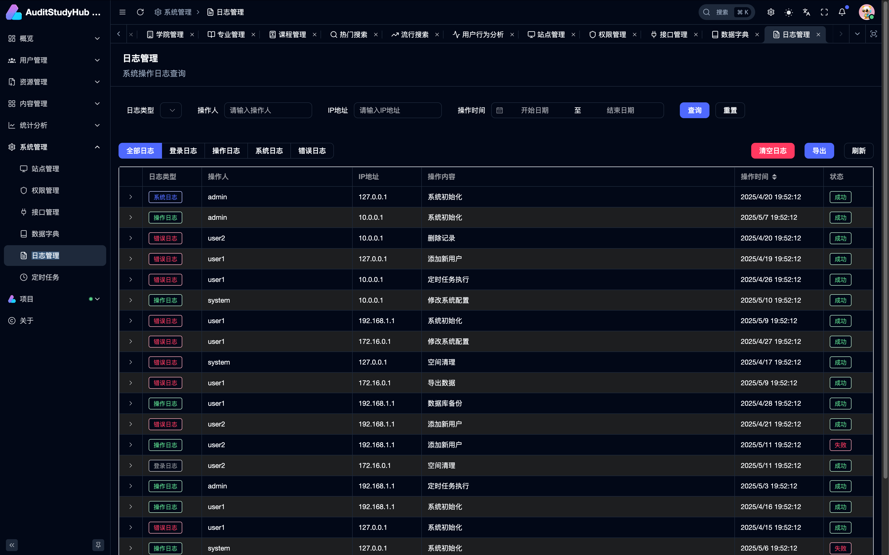

[](https://git.io/typing-svg)
[English Documentation](./README_EN.md) | [中文文档](./README.md)


## 📚 Project Overview

🚀 Audit Study Hub: A higher education resource sharing platform based on microservice architecture, integrating AI search and intelligent recommendations, making it easy to acquire, share, and manage learning resources, creating an efficient campus knowledge ecosystem.

Audit Study Hub is a resource sharing platform specifically designed for university students, aimed at solving the pain points of accessing professional materials and teaching resources during the learning process. The platform adopts a microservice architecture with a frontend-backend separation design, integrating modern cloud-native technology stack to provide rich resource management and search functions.

Through Audit Study Hub, users can:

- 🔍 **Quick Search**: Quickly find needed materials using an Elasticsearch-based advanced search engine
- 📤 **Resource Sharing**: Upload quality learning materials and share knowledge with campus peers
- 📩 **Resource Requests**: Publish needs for specific learning resources
- ⭐ **Favorites Management**: Bookmark frequently used materials for easy future access
- 👤 **Personal Center**: Manage personal profiles, upload records, download history, and favorites
- 🌟 **Resource Rating**: Like and review resources to filter quality content

## 🏗️ System Architecture

Audit Study Hub adopts a cloud-native architecture based on microservices, mainly including the following parts:

### Product Architecture Diagram



- **Frontend Application Layer**: SPA application built with Vue3, Element Plus, and Vite
- **API Gateway**: Using Spring Cloud Gateway to implement routing, load balancing, authentication, etc.
- **Business Service Cluster**: Spring Boot-based microservices, including user service, resource service, comment service, etc.
- **Service Governance**: Using Nacos for service registration, discovery, and configuration management
- **Message Queue**: Implementing asynchronous communication between services through RabbitMQ, such as synchronizing resources to Elasticsearch
- **Persistence Layer**: Using MySQL to store structured data, Elasticsearch for full-text search requirements

### Package Structure Diagram


## 🔧 Technology Stack

### Backend Technology Stack

| Technology          | Version    | Description         |
| ------------------- | ---------- | ------------------- |
| Java                | 17         | Runtime Environment |
| Spring Boot         | 3.1.5      | Application Framework |
| Spring Cloud        | 2022.0.4   | Microservice Solution |
| Spring Cloud Alibaba | 2022.0.0.0 | Alibaba Microservice Ecosystem |
| MyBatis-Plus        | 3.5.3.2    | ORM Framework       |
| Spring Security     | 5.7.x      | Security Framework  |
| JWT                 | 0.11.x     | Authentication & Authorization |
| MySQL               | 8.0.33     | Relational Database |
| Redis               | 6.2        | Cache & Distributed Lock |
| Elasticsearch       | 8.10.4     | Full-text Search Engine |
| RabbitMQ            | 3.9        | Message Queue       |
| Nacos               | 2.2.0      | Service Discovery & Configuration Management |
| Docker              | 20.10+     | Containerized Deployment |
| Prometheus + Grafana | -         | Monitoring Visualization |

### Frontend Technology Stack

| Technology    | Version    | Description        |
| ------------- | ---------- | ------------------ |
| Node.js       | >=20.10.0  | Runtime Environment |
| Vue           | 3.5.13     | Frontend Framework |
| Vite          | 6.3.1      | Build Tool        |
| Element Plus  | 2.9.9      | UI Component Library |
| Vue Router    | 4.5.1      | Routing Management |
| Pinia         | 3.0.2      | State Management  |
| Axios         | 1.9.0      | HTTP Client       |
| TypeScript    | 5.7.2      | Type System       |
| ECharts       | 5.x        | Data Visualization |
| Sass          | 1.88.0     | CSS Preprocessor  |
| ESLint        | 8.x        | Code Quality Check |
| Nginx         | 1.20+      | Static Resource Server |

## 🚀 Core Functions

### 1. Resource Management System

- **Resource Classification System**: Multi-level category management, supporting organization by college, major, course, etc.
- **Resource Upload**: Supporting various file format uploads with automatic file metadata extraction
- **Resource Review**: Administrator review mechanism ensuring content quality and compliance
- **Version Control**: Supporting resource updates and historical version viewing

### 2. Advanced Search Engine

- **Full-text Search**: Elasticsearch-based full-text search with Chinese word segmentation
- **Advanced Filtering**: Multi-dimensional filtering, including categories, colleges, file size, upload time, etc.
- **Relevance Ranking**: Intelligent sorting algorithm based on user behavior and document features
- **Search Suggestions**: Providing search suggestions based on popular searches and user history
- **Search Result Highlighting**: Keyword highlighting in results

### 3. User System

- **Account Management**: Registration, login, password reset, personal profile management
- **Permission Control**: RBAC-based permission model
- **User Behavior Analysis**: Recording user search, download, collection, and other behaviors

### 4. Interaction Features

- **Comment System**: Commenting and discussing resources
- **Like/Favorite**: Supporting resource likes and personal favorites
- **Resource Requests**: Publishing specific resource needs
- **Notification System**: Site messages and email notifications

### 5. Admin Dashboard

- **User Management**: Managing user accounts, permissions, and behaviors
- **Resource Management**: Reviewing, editing, and deleting resources
- **Data Statistics**: Platform usage and popular resource analysis
- **System Monitoring**: Service health status and performance monitoring, supporting user behavior monitoring via logs
- **System Management**: Providing maintenance for interfaces, menus, and data dictionaries

## 📱 System Functions and Interface Display

### Data Models and Design

#### Database ER Diagram


#### Use Case Diagram


### User Interface and Functions

| | |
|---|---|
| **Homepage** | **Infinite Comment Tree** |
|  |  |
| **Resource List** | **Resource Details** |
|  |  |
| **Resource Requirements** | **Upload Resource** |
|  |  |
| **Personal Information** | **Admin Login** |
|  |  |
| **Admin Registration** | **Admin Resource Management** |
|  |  |
| **Admin Comment Management** | **Admin User Behavior Analysis** |
|  |  |
| **API Management** | **Log Management** |
|  |  |

## 📁 Project Structure

```
AuditStudyHub/
├── audit-study-hub-cloud/ # Backend Microservice Project
│ ├── audit-study-hub-backend/ # Main Business Service
│ │ ├── src/main/java/com/auditStudyHub/
│ │ │ ├── controller/ # Controller Layer
│ │ │ ├── service/ # Service Layer
│ │ │ ├── mapper/ # Database Mapping Layer
│ │ │ ├── entity/ # Entity Classes
│ │ │ ├── dto/ # Data Transfer Objects
│ │ │ ├── document/ # ES Document Models
│ │ │ ├── config/ # Configuration Classes
│ │ │ ├── exception/ # Exception Handling
│ │ │ └── util/ # Utility Classes
│ │ └── src/main/resources/ # Configuration Resources
│ ├── audit-study-hub-config/ # Configuration Service
│ ├── audit-study-hub-registry/ # Service Registry Center
│ ├── elasticsearch/ # ES Configuration and Data
│ ├── mysql/ # MySQL Configuration and Scripts
│ ├── redis/ # Redis Configuration
│ ├── rabbitmq/ # RabbitMQ Configuration
│ ├── nacos/ # Nacos Configuration
│ ├── prometheus/ # Monitoring Configuration
│ ├── grafana/ # Monitoring Visualization
│ ├── k8s/ # Kubernetes Configuration
│ └── docker-compose.yml # Docker Orchestration File
│
├── audit-study-hub-frontend/ # Frontend Vue Project
│ ├── public/ # Static Resources
│ └── src/
│ ├── api/ # API Interfaces
│ ├── assets/ # Static Resources
│ ├── components/ # Common Components
│ ├── router/ # Router Configuration
│ ├── stores/ # State Management
│ ├── types/ # TypeScript Type Definitions
│ ├── utils/ # Utility Functions
│ └── views/ # Page Components
│
└── audit-study-hub-admin/ # Admin Dashboard Project
├── apps/
│ └── web-ele/ # Element Plus-based Management Interface
└── packages/ # Common Packages
```


## 📦 Quick Deployment Guide

The system provides a complete set of deployment scripts to quickly deploy the entire microservice architecture and related components.

### Environment Requirements

- JDK 17
- Maven 3.6+
- Node.js 21
- Docker & Docker Compose
- MySQL 8.0+
- Redis 6.0+

### 1. Using Deployment Scripts

The project provides a one-click deployment script located in the `audit-deployment` directory:

```bash
# Enter deployment directory
cd audit-deployment

# Grant execution permissions
chmod +x start.sh

# Execute deployment script
bash start.sh
```

The script will automatically complete the following tasks:
- Clean existing Docker containers
- Create necessary directory structures
- Create Docker networks
- Start all basic services (MySQL, Redis, RabbitMQ, Nacos, Elasticsearch, Kibana, Prometheus, Grafana)
- Compile Spring Boot microservices
- Generate detailed deployment reports and access information

### 2. Configure Sensitive Information

Before importing Nacos configuration, please modify the following sensitive information:

#### Alibaba Cloud OSS Configuration

Edit the `audit-deployment/DEFAULT_GROUP/.env.dev` file and fill in your Alibaba Cloud OSS information:

```bash
# Alibaba Cloud OSS Configuration
OSS_ENDPOINT=https://oss-cn-region.aliyuncs.com    # Replace with your OSS endpoint
OSS_ACCESS_KEY_ID=your_access_key_id              # Replace with your AccessKey ID
OSS_ACCESS_KEY_SECRET=your_access_key_secret      # Replace with your AccessKey Secret
OSS_BUCKET_NAME=your_bucket_name                  # Replace with your bucket name
OSS_URL_PREFIX=https://your_bucket_name.oss-cn-region.aliyuncs.com  # Replace with your bucket access URL
```

#### Email Configuration

Edit the `audit-deployment/DEFAULT_GROUP/.env.dev` file and fill in your email information:

```bash
# Email Configuration
MAIL_HOST=smtp.163.com                         # Mail server address
MAIL_USERNAME=your_email@163.com               # Replace with your email address
MAIL_PASSWORD=your_email_auth_code             # Replace with your email authorization code
```

> **Important Note**: Please be sure to complete the modification of sensitive information before importing the Nacos configuration, otherwise, it may cause functionality to be unavailable or security risks.

### 3. Import Nacos Configuration

During script execution, you need to manually import the Nacos configuration:

1. Create a folder named **DEFAULT_GROUP**
2. Copy three configuration files to the folder:
   - application-backend.yml
   - application-backend-dev.yml
   - .env.dev
3. Compress the entire folder to **DEFAULT_GROUP.zip**
4. Log in to the Nacos console: http://localhost:8848/nacos/ (username/password: nacos/nacos)
5. Import the zip file in the console

### 4. Start Backend Microservices

```bash
# Enter jars directory
cd audit-deployment/jars

# Start services in order
# 1. First start the registry center
java -jar audit-study-hub-registry-0.0.1-SNAPSHOT.jar

# 2. Then start the configuration center
java -jar audit-study-hub-config-0.0.1-SNAPSHOT.jar

# 3. Finally start the backend service
java -jar audit-study-hub-backend-0.0.1-SNAPSHOT.jar
```

### 5. Start Frontend Applications

#### Admin Dashboard

```bash
# Enter admin directory
cd audit-study-hub-admin

unset NODE_OPTIONS

nvm install 21
nvm use 21

# Install dependencies
pnpm install

# Start development server
pnpm dev:ele
```

Access address: http://localhost:5777

#### User Frontend

```bash
# Enter frontend directory
cd audit-study-hub-frontend

# Install dependencies
npm install

# Start development server
npm run dev
```

Access address: http://localhost:3000

### 6. Service Access Addresses

| Service Name | Access Address | Username/Password | Description |
|--------------|----------------|-------------------|-------------|
| Admin Frontend | http://localhost:5777 | - | System Management Interface |
| User Frontend | http://localhost:3000 | - | User Learning Interface |
| Nacos | http://localhost:8848/nacos/ | nacos/nacos | Service Registry and Configuration Center |
| Elasticsearch | http://localhost:9201 | - | Full-text Search Engine |
| Kibana | http://localhost:5601 | - | ES Data Visualization |
| Prometheus | http://localhost:9090 | - | Monitoring Data |
| Grafana | http://localhost:13000 | admin/admin | Monitoring Dashboard |
| RabbitMQ | http://localhost:15672 | guest/guest | Message Queue Management Interface |
| MySQL | localhost:13306 | root/root | Database Service |
| Redis | localhost:16379 | - | Cache Service |

For more detailed deployment instructions, please refer to the `audit-deployment/Instructions.md` file.

## 📋 User Guide

### Access Addresses

- **Frontend Application**: http://localhost:80
- **API Documentation**: http://localhost:5777/doc.html
- **Backend API Gateway**: http://localhost:5777
- **Admin Dashboard**: http://localhost:5173

### Monitoring and Management Tools

- **Nacos Console**: http://localhost:8848/nacos (username/password: nacos/nacos)
- **RabbitMQ Management Interface**: http://localhost:15672 (username/password: guest/guest)
- **Elasticsearch**: http://localhost:9201
- **Kibana**: http://localhost:5601
- **Prometheus**: http://localhost:9090
- **Grafana**: http://localhost:13000 (username/password: admin/admin)

## 💡 Project Features

1. **Microservice Architecture**: Implementing highly available and scalable microservices based on the Spring Cloud ecosystem
2. **High-performance Search**: Implementing complex full-text search and multi-dimensional filtering with Elasticsearch
3. **Cloud-native Support**: Fully containerized, supporting Docker and Kubernetes deployment
4. **Advanced Caching Strategy**: Multi-level cache design improving system response speed
5. **Real-time Data Synchronization**: Message-driven architecture based on RabbitMQ ensuring data consistency
6. **Comprehensive Monitoring**: Integrating Prometheus and Grafana for all-around system monitoring
7. **Extensible Design**: Modular and plugin-based design for easy functionality extension
8. **Responsive Frontend**: Modern responsive frontend based on Vue3, supporting multi-terminal adaptation

## 🛠️ Development Guide

### Backend Development Standards

1. **Code Style**: Following Alibaba Java Development Manual standards
2. **Package Naming**: Division by functional modules, com.auditStudyHub.[module].[layer]
3. **Interface Design**: Following RESTful API design specifications
4. **Error Handling**: Unified exception handling, standardized return results
5. **Documentation**: Using Swagger annotations to generate API documentation

### Frontend Development Standards

1. **Component Design**: Following single responsibility principle
2. **State Management**: Proper use of Pinia for global state management
3. **TypeScript**: Using type definitions to improve code quality
4. **Style Management**: Using Sass for modular style management
5. **Responsive Design**: Adapting to different screen sizes

### Development Process

1. Pull the latest code and create a feature branch
2. Develop and test locally
3. Submit PR request and pass code review
4. Merge into the main branch and automatically deploy

## 📋 TODO List

Here are the features and improvements we are planning:

- [ ] **Admin Dashboard Enhancement**
  - Enhance resource review process
  - Improve user behavior analysis module
  - Add more statistical dimensions

- [ ] **Documentation Improvement**
  - Write detailed user operation manual
  - Improve API documentation
  - Add Frequently Asked Questions (FAQ)

- [ ] **Recommendation Algorithm Enhancement**
  - Implement personalized recommendations based on user behavior
  - Add collaborative filtering algorithm
  - Integrate large language models to improve recommendation accuracy

- [ ] **Internationalization Support**
  - Add English interface
  - Support multi-language switching
  - Optimize international resource display

- [ ] **Database Optimization**
  - Optimize table structure design
  - Add database sharding strategy
  - Improve data backup and recovery mechanisms

- [ ] **Performance Optimization**
  - Optimize frontend loading speed
  - Enhance caching strategy
  - Improve search engine performance

We welcome all kinds of contributions! If you're interested in any of the above items, please refer to the contribution guidelines below to participate in the project development.

## 👨‍💻 Team and Contributions

### Core Team

- **Auroral** - Project Lead & Full-Stack Developer

### Contribution Guidelines

1. Fork the project
2. Create your feature branch (`git checkout -b feature/amazing-feature`)
3. Commit your changes (`git commit -m 'Add some amazing feature'`)
4. Push to the branch (`git push origin feature/amazing-feature`)
5. Open a Pull Request

## 📄 License

[MIT](LICENSE) © Audit Study Hub Team

---

## 📞 Contact Us

- **Email**: 15968588744@163.com
- **QQ**: 1957689514
- **Issue Feedback**: [GitHub Issues](https://github.com/Auroral0810/audit-study-hub/issues)
- **WeChat Official Account**: AuditStudyHub

---

Thank you for your interest in the Audit Study Hub project! We look forward to your participation and contribution to create a better campus resource sharing platform together.
